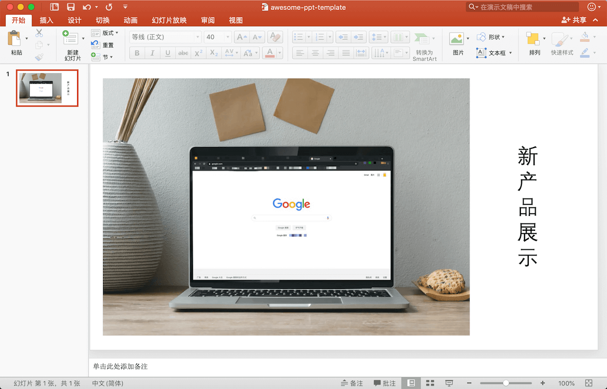

# Awesome-PPT
惊艳的 PPT，实用 PPT 技巧。

- [Awesome-PPT](#awesome-ppt)
  - [图片](#图片)
    - [产品演示图](#产品演示图)
    - [创意单图](#创意单图)
  - [动效](#动效)

## 图片

本部分为图片处理技巧。

**工具**

- [图片压缩](https://tinypng.com/)

### 产品演示图

**需求**

在 PPT 中演示新产品，产品需要显示在实际使用环境中(如电脑或手机)。

**预期效果图**

**实现方法**

你可能会使用如下方法来实现这样的图片：
- 摆拍
- P 图

那么有没有简单方法呢？答案是肯定的。

**教程**

👉 [产品演示图生成方式](tutorial/tutorial-image-1.md) 👈

### 创意单图

## 动效