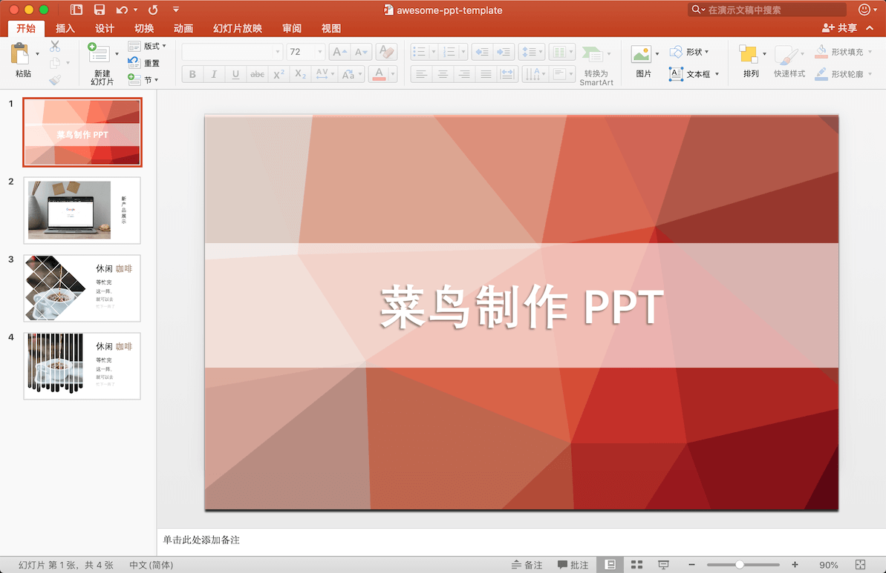
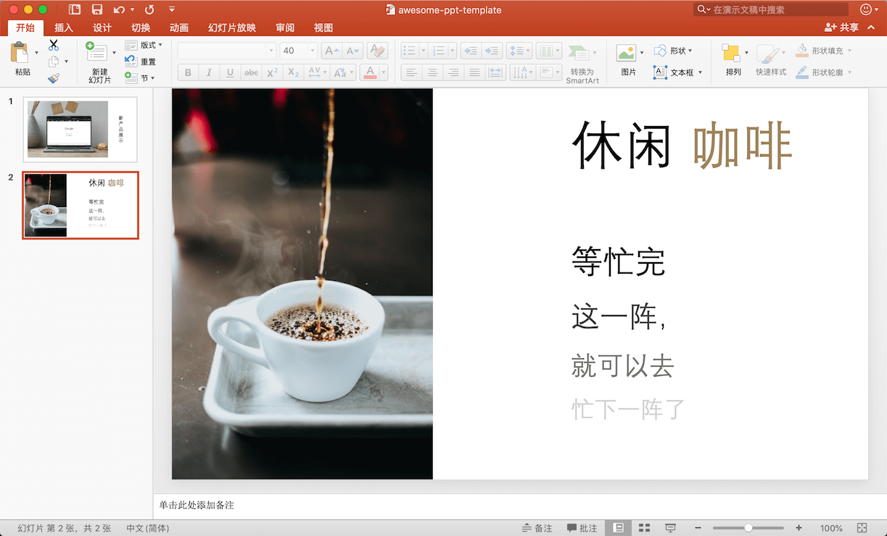
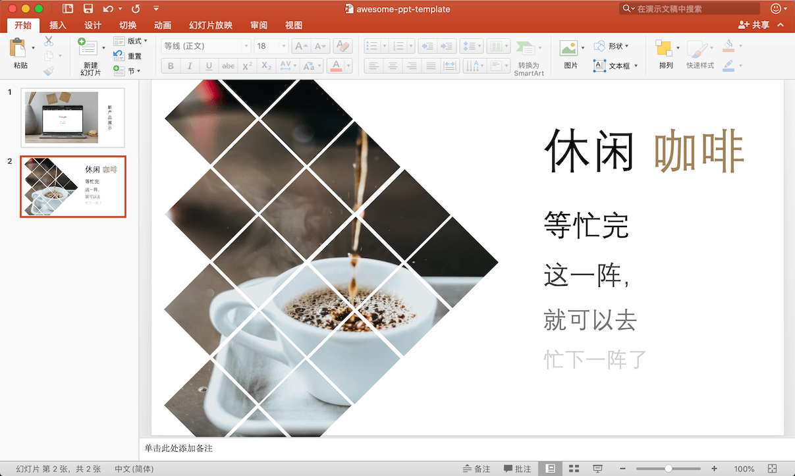

# Awesome-PPT
惊艳的 PPT，实用 PPT 技巧。

- [Awesome-PPT](#awesome-ppt)
  - [图片](#图片)
    - [纹理背景图](#纹理背景图)
    - [产品演示图](#产品演示图)
    - [创意单图](#创意单图)
  - [动效](#动效)

## 图片

本部分为图片处理技巧。

**工具**

- [图片压缩](https://tinypng.com/)
- [随机纹理图](https://trianglify.io/)
- [Smartmockups](https://smartmockups.com/)

### 纹理背景图

**需求**

PPT 增加一个带纹理的背景图。

**预期效果图**

**教程**

浏览器中打开网址 [trianglify.io](https://trianglify.io/)，配置参数即可生成想要的图片。不过导出高清图是收费的，但是你可以把浏览器窗口放大，通过截图的方式获取想要的大小。

---

### 产品演示图

**需求**

在 PPT 中演示新产品，产品需要显示在实际使用环境中(如电脑或手机)。

**预期效果图**

**实现方法**

你可能会使用如下方法来实现这样的图片：
- 摆拍
- P 图

那么有没有简单方法呢？答案是肯定的。

**教程**

👉 [产品演示图生成方式](tutorial/tutorial-image-1.md) 👈

---

### 创意单图

**需求**

PPT 中展示的一张图片显得过于呆板，有什么办法让它看起来更加有创意呢？

**教程**

👉 [PPT 创意图片制作方法](tutorial/tutorial-image-2.md) 👈

---

## 动效