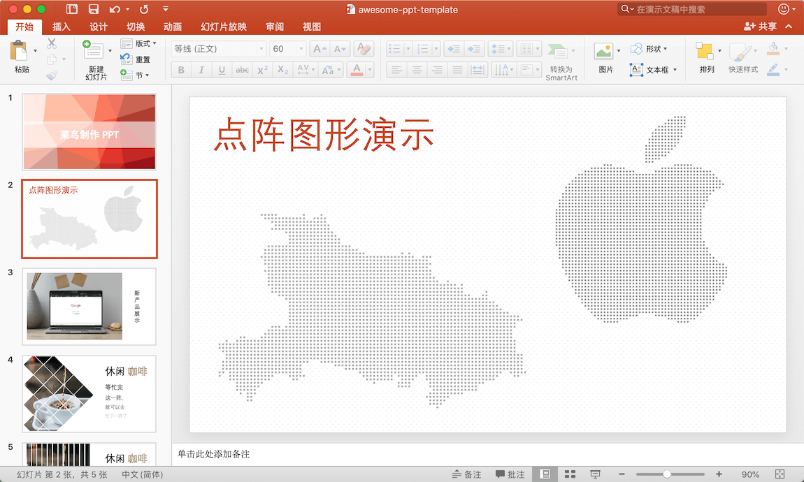
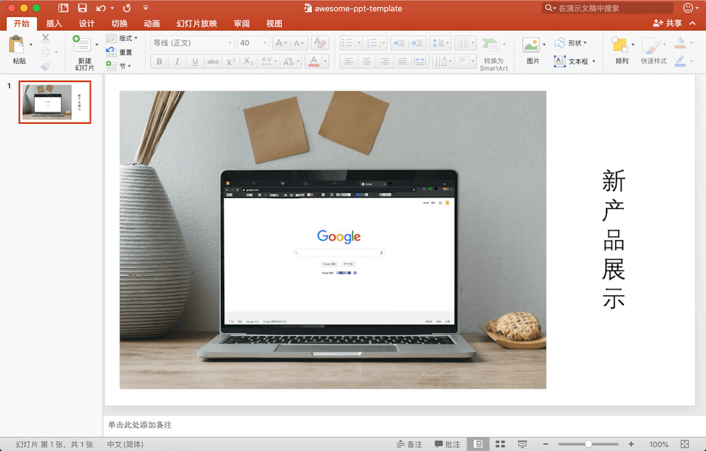
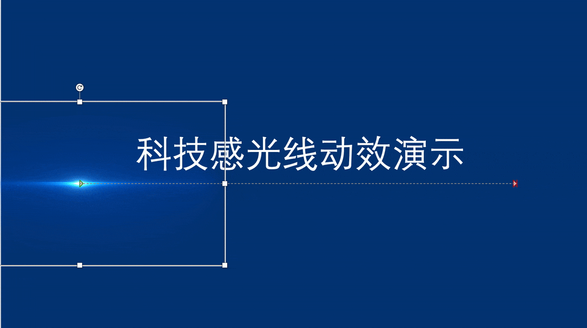

# Awesome-PPT
惊艳的 PPT，实用 PPT 技巧。

- [Awesome-PPT](#awesome-ppt)
  - [图片](#图片)
    - [纹理背景图](#纹理背景图)
    - [点阵图](#点阵图)
    - [产品演示图](#产品演示图)
    - [创意图片排版](#创意图片排版)
  - [动效](#动效)
    - [科技感光线动效](#科技感光线动效)

## 图片

本部分为图片处理技巧。

**工具**

- [图片压缩](https://tinypng.com/)
- [生成随机三角纹理图形](https://natee.github.io/website/login.html#/trianglify)
- [图片转化为点阵图形](https://natee.github.io/website/login.html#/image2text)
- [Smartmockups](https://smartmockups.com/)

---
### 纹理背景图

**需求**

PPT 增加一个带纹理的背景图。

**预期效果图**

**教程**

浏览器中打开网址 [生成随机三角纹理图形](https://natee.github.io/website/login.html#/trianglify)，配置参数即可生成想要的图片。你可以导出图形为 PNG 或 SVG。

感谢 [trianglify.io](https://trianglify.io/)，由于原网址无法导出想要的大小，所以重新写了一个以支持导出。

---

### 点阵图

**需求**

单独显示一个地图（或任何图片）时觉得不好看，我们需要将其转化成点状轮廓图使其看起来更具科技感。

**预期效果图**

**教程**

浏览器中打开网址 [图片转点阵图](https://natee.github.io/website/login.html#/image2text)

---

### 产品演示图

**需求**

在 PPT 中演示新产品，产品需要显示在实际使用环境中(如电脑或手机)。

**预期效果图**

**实现方法**

你可能会使用如下方法来实现这样的图片：
- 摆拍
- P 图

那么有没有简单方法呢？答案是肯定的。

**教程**

👉 [产品演示图生成方式](tutorial/产品演示图生成方式/README.md) 👈

---

### 创意图片排版

**需求**

PPT 中展示的一张图片显得过于呆板，有什么办法让它看起来更加有创意呢？

**教程**

👉 [PPT 创意图片制作方法](tutorial/创意图片制作方法/README.md) 👈

---

## 动效

### 科技感光线动效

**需求**

主讲科技的 PPT 不够科技感，有什么妙招呢？

**教程**

👉 [PPT 添加科技感光线动效](tutorial/科技感光线动效/README.md) 👈

---

