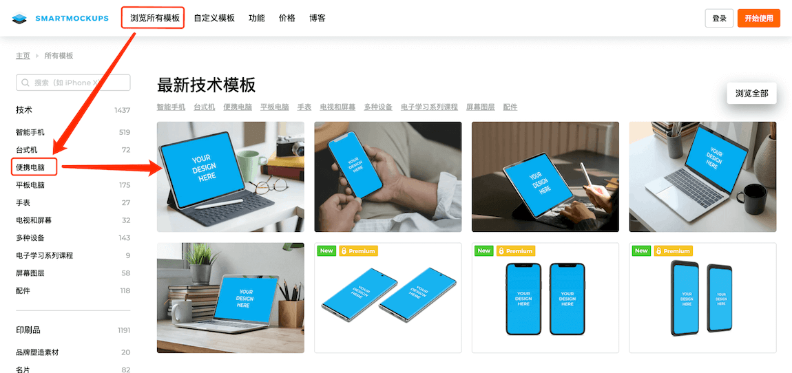
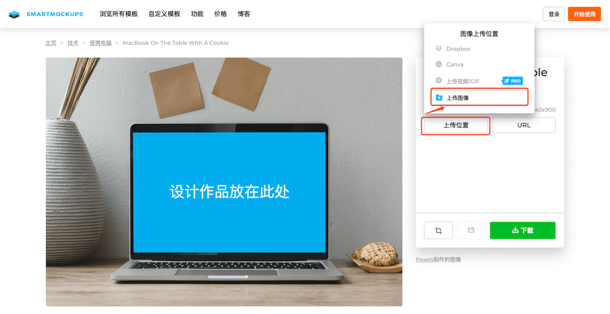
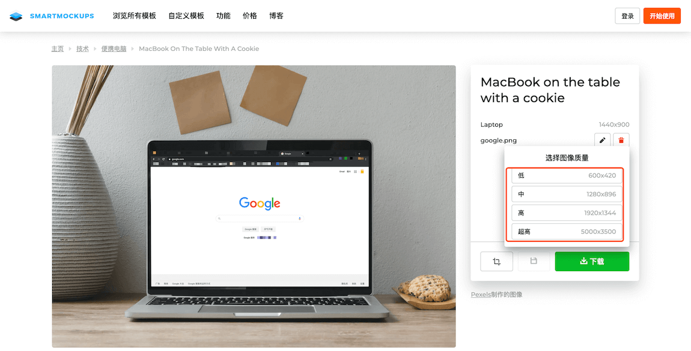

# 产品演示图生成方式

1. 打开 [Smartmockups](https://smartmockups.com/) 网址
2. 点击上方导航栏**浏览所有模板**
3. 点击左侧导航栏**便携电脑**
4. 在右侧选择想要的模版
   

5. 上传自己的产品图进行模板合成
   

6. 你可以对图像进行裁剪旋转等操作，完成后点击继续，你将得到想要的图片
7. 点击下载即可选择不同分辨率图片进行下载
   

😃 现在，忘了花上数小时学习如何使用 Photoshop 的痛苦吧。通过 Smartmockups，能直接在浏览器中，在一个界面中跨多个设备创建令人惊艳的高分辨率模板。
