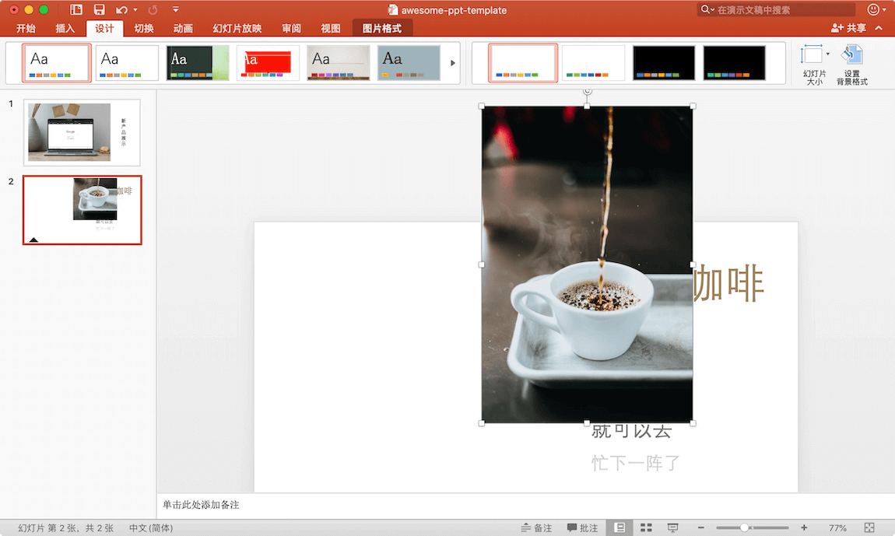
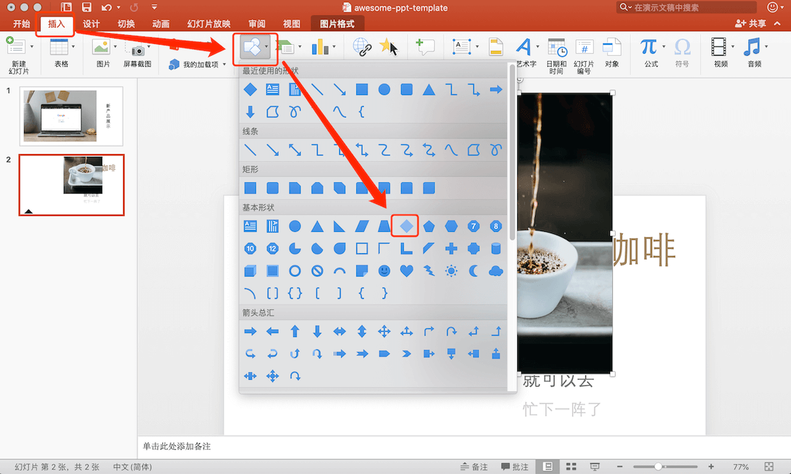
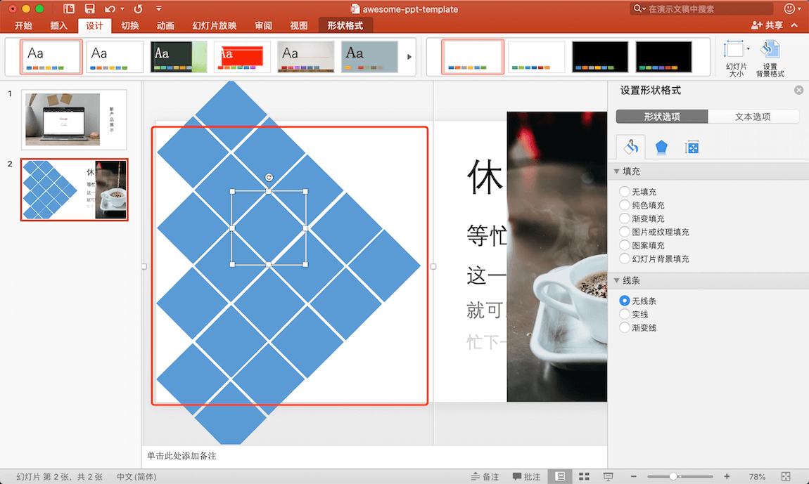
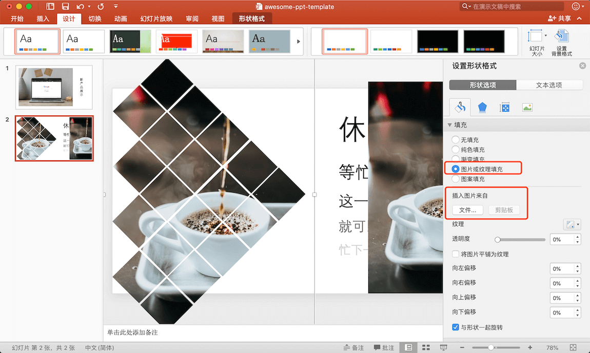
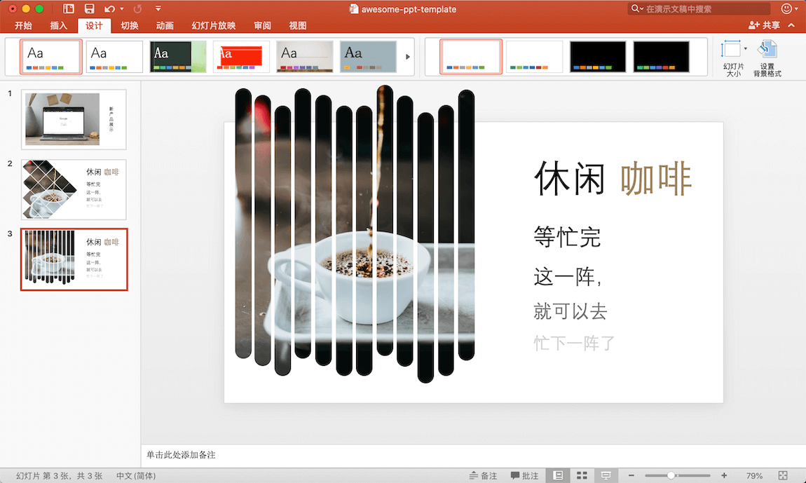

# PPT 创意图片制作方法

1. 插入图片，把图片调整为合适大小，选中图片后复制图片
   
   

2. 插入形状，这里我选择的是菱形
   
   

3. 复制形状若干个，然后将其排列成想要的形状，选中这些形状，右键“组合”

   

4. 设置形状格式，“填充”选择“图片或纹理填充”，“插入图片”选择“剪贴板”（刚才复制来图片，也可以直接选择文件），“线条”选择“无线条”
   
   

5. 调整形状图片至合适位置即可

## 发散

运用此技巧，你可以创建其它形式的创意图片，如下：

  