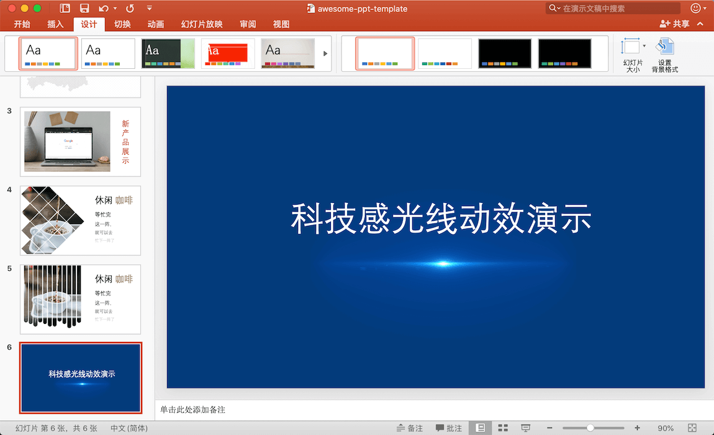
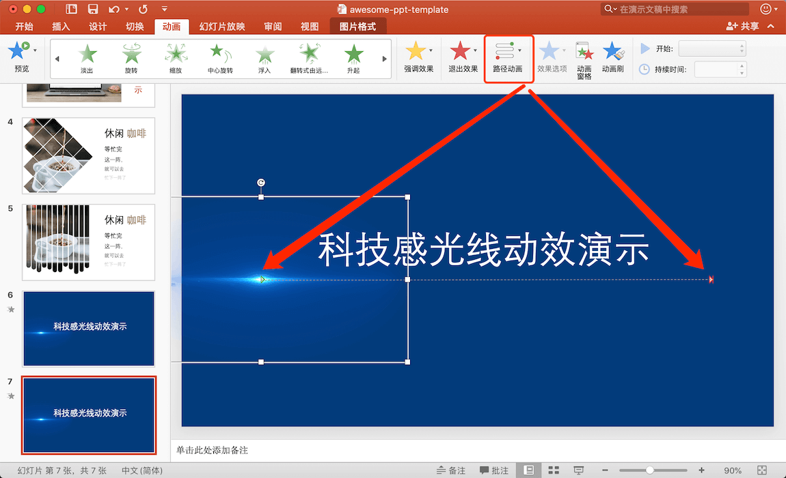
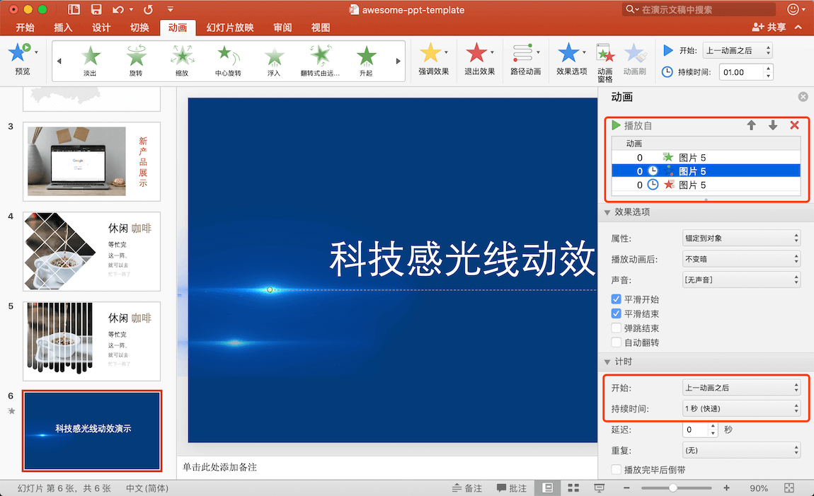

# PPT 创意图片制作方法

1. 准备好基本素材页面
   
   

2. 选中光效素材，把素材调整到合适的出现位置，菜单栏选择动画，选择“淡出”
   
   

3. 选中光效素材，设置路径动画，调整动画开始和结束的点

   

4. 选中光效素材，菜单栏选择动画，退出效果选择“淡出”
   
5. 右侧动画面板设置各个动画的播放选项
      - 第一个动画“开始”选项选择“与上一动画同时”
      - 其余动画“开始”选项选择“上一动画之后”

   

6. 你将得到如下的效果：

   

## 发散

运用此技巧，你可以创建其它形式的创意动效：

  